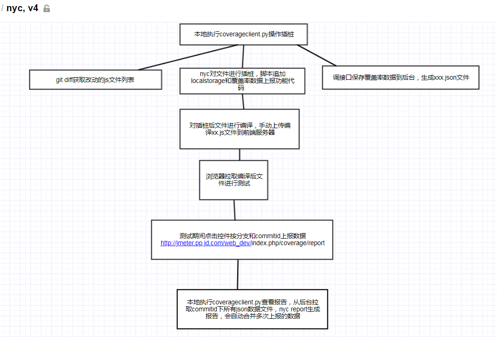

# 代码覆盖率

## JavaScript Coverage

1. Git Diff
* 分支间Diff

>git diff master feature_detail_shop_gift --stat > E:\\diff\\diffresult.diff
pages/components/shop/api.js    | 375 +++++++++++++++++++++++++++++++++++++++  
pages/components/shop/shop.css  |  48 ++++-  
pages/components/shop/shop.js   | 378 +++++++++-------------------------------  
pages/components/shop/shop.wxml |  42 ++++-  
pages/item/detail/detail.js     |   7 +-  
pages/item/featured/featured.js |   7 +-  
pages/item/pingou/pingou.js     |   7 +-  
7 files changed, 554 insertions(+), 310 deletions(-)  

* 单个文件Diff
>git diff master feature_detail_shop_gift pages/components/shop/api.js > E:\\diff\\diffresult.diff

* Python difflib库
>difflib.Differ().compare(src,base)

2. Istanbul工具
* 安装  
    $ npm install -g istanbul   
    $ npm install -g mocha  
    $ npm install should --save-dev  
    $ istanbul cover simple.js //获取覆盖率数据
    $ yarn global add git+https://github.com/istanbuljs/nyc.git
  

* 生成报告  
*对同一个目录下的json数据，会自动合并加总报告数据*  
>nyc report --reporter html --temp-dir C:\Users\zhongjianli\PycharmProjects\JSCover\jscover\ --report-dir C:\Users\zhongjianli\PycharmProjects\JSCover\jscover\

3. 覆盖率接入工具样例  

* 上报数据在服务器的保存目录  
/export/servers/apache/htdocs/web_dev/coverdata  
* get请求服务器json覆盖率数据文件示例  
http://jmeter.pp.jd.com/web_dev/coverdata/testbranch/testcommitid/data_1555054920.json  
* 覆盖率数据上报接口  
http://jmeter.pp.jd.com/web_dev/index.php/coverage/report  
* 查询指定commitid下有哪些json文件  
http://jmeter.pp.jd.com/web_dev/index.php/coverage/getJsonFiles?branch=testbranch&commitid=testcommitid  
* 生成报告命令示例  
nyc report --reporter html --temp-dir E:\code\autorelease_20190409\d26a1b83d8d9c62dfb87cc65dce022c49206c2a6 --report-dir E:\code\coverage_report\d26a1b83d8d9c62dfb87cc65dce022c49206c2a6  
* 脚本运行命令示例  
python coverageclient.py -d E:\code\wxapp -b autorelease_20190409 -c d26a1b83d8d9c62dfb87cc65dce022c49206c2a6  
  
## FAQ
Q1：源代码拷贝耗时最多： 2019-04-21 09:38:12,482 : DEBUG : copy source code from E:\code\wxapp\ to E:\code\wxapp-copy  
> 1）合适的拷贝命令：os.system执行拷贝命令 os.system ("xcopy /s %s %s"% (dirname1, dirname2))比shutil.copytree节省近一半耗时  
2）排除不需要拷贝的文件目录： 后面发现是拷贝了node modles目录下的文件导致耗时长（git 因为.gitignore文件指明了忽略该目录，所以不影响git diff命令） ；通过xcopy的 /EXCLUDE:exclude.txt，在文件指定拷贝过程中要忽略的目录，比如node_modles；把复制文件数从25789减少到7000多，之前要10分钟现在1分钟完成  

Q2: 如何保证增量diff不包含跟版本特性无关的代码
>1) 保证新特性新拉分支  
>2) 从差异结果剔除所有merge进来的代码  
>2.1) 从git log，查看中间有哪些merge操作，把commitid和前一次的commitid放到一起保存下来  
commit 5ba218de736826820ceaf2f5e06e74d14a3c6a96  
Merge: 5212724476 f9ab757a86  
Author: maxueqin1 <maxueqin@jd.com>  
Date:   Fri Aug 9 11:16:11 2019 +0800  
    Merge branch 'feature_pingou_detail_new' of git.jd.com:wxapp/wxapp into feature_pingou_detail_new  
commit 5212724476335af2b158cd0a3f159ac535074da7  
Author: maxueqin1 <maxueqin@jd.com>  
Date:   Fri Aug 9 11:15:57 2019 +0800  
    fix(商详):@19849，埋点修复  
>2.2) 把所有merge影响到的文件名和改动行（行号+内容）获取到  
git diff 5ba218de736826820ceaf2f5e06e74d14a3c6a96  5212724476335af2b158cd0a3f159ac535074da7 --stat  
zhongjianli@SZ-WXSQ-0437A MINGW64 /e/zhongjianli/wxapp/app_pingou (feature_pingou_detail_new)  
$ git diff 5ba218de736826820ceaf2f5e06e74d14a3c6a96  5212724476335af2b158cd0a3f159ac535074da7 --stat  
 pages/item/detail/detail.wxml | 4 ++--  
 1 file changed, 2 insertions(+), 2 deletions(-)  
>2.3) 拿第一次commitid和最后一次commitid进行diff拿到差异结果，按照文件名来遍历，文件名匹配到了就查看下merge进来的内容在不在（行号顺序用来辅助判断，行号相等不可靠），在就从差异结果里面剔除掉，差异行数量为0的文件不需要插桩
>方案存在的问题：如果对merge进来的内容有修改，剔除会遗漏，但这部分当成特性代码也是合理的  

